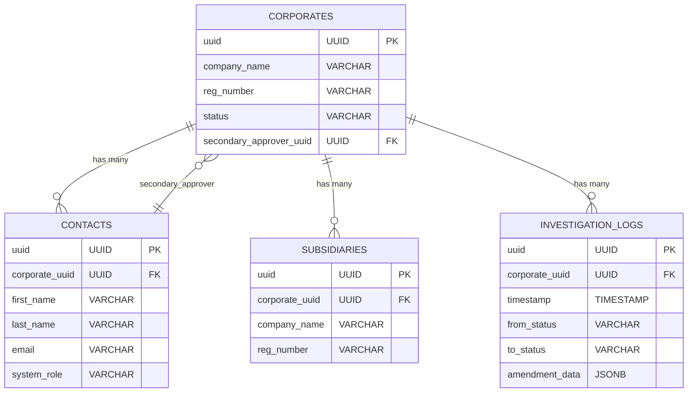

# Database Schema Documentation

## Overview
This document provides a comprehensive overview of the HappyToken Backend database schema, including table structures, relationships, indexes, and migration history.

## Database Engine
- **Engine**: PostgreSQL (Neon compatible)
- **Connection**: Via `DATABASE_URL` environment variable
- **ORM**: Kysely with TypeScript types

## Table Overview

| Table | Description | Primary Key | Foreign Keys |
|-------|-------------|-------------|--------------|
| `corporates` | Main corporate accounts | `uuid` | - |
| `contacts` | Corporate contacts | `uuid` | `corporate_uuid` → `corporates.uuid` |
| `subsidiaries` | Corporate subsidiaries | `uuid` | `corporate_uuid` → `corporates.uuid` |
| `investigation_logs` | Audit trail for corporate changes | `uuid` | `corporate_uuid` → `corporates.uuid` |

## Table Schemas

### Corporates Table

**Primary Table**: `corporates`

**Purpose**: Stores corporate account information including company details, addresses, commercial terms, and approval status.

#### Columns

| Column | Type | Constraints | Description |
|--------|------|-------------|-------------|
| `uuid` | UUID | PRIMARY KEY, DEFAULT gen_random_uuid() | Unique identifier |
| `company_name` | VARCHAR(255) | NOT NULL | Company name |
| `reg_number` | VARCHAR(50) | NOT NULL, UNIQUE | Registration number |
| `status` | VARCHAR(50) | NOT NULL | Corporate status (enum) |
| `office_address1` | VARCHAR(255) | NOT NULL | Primary office address |
| `office_address2` | VARCHAR(255) | NULL | Secondary office address |
| `postcode` | VARCHAR(20) | NOT NULL | Postal code |
| `city` | VARCHAR(100) | NOT NULL | City |
| `state` | VARCHAR(100) | NOT NULL | State/Province |
| `country` | VARCHAR(100) | NOT NULL, DEFAULT 'Malaysia' | Country |
| `website` | VARCHAR(255) | NULL | Company website |
| `account_note` | TEXT | NULL | Account notes |
| `billing_same_as_official` | BOOLEAN | NOT NULL, DEFAULT true | Billing address same as official |
| `billing_address1` | VARCHAR(255) | NULL | Billing address line 1 |
| `billing_address2` | VARCHAR(255) | NULL | Billing address line 2 |
| `billing_postcode` | VARCHAR(20) | NULL | Billing postal code |
| `billing_city` | VARCHAR(100) | NULL | Billing city |
| `billing_state` | VARCHAR(100) | NULL | Billing state |
| `billing_country` | VARCHAR(100) | NULL, DEFAULT 'Malaysia' | Billing country |
| `company_tin` | VARCHAR(50) | NULL | Tax identification number |
| `sst_number` | VARCHAR(50) | NULL | SST number |
| `agreement_from` | DATE | NULL | Agreement start date |
| `agreement_to` | DATE | NULL | Agreement end date |
| `credit_limit` | VARCHAR(20) | NOT NULL, DEFAULT '0.00' | Credit limit |
| `credit_terms` | VARCHAR(10) | NULL | Credit terms |
| `transaction_fee` | VARCHAR(10) | NULL | Transaction fee |
| `late_payment_interest` | VARCHAR(10) | NULL | Late payment interest |
| `white_labeling_fee` | VARCHAR(10) | NULL | White labeling fee |
| `custom_feature_fee` | VARCHAR(20) | NOT NULL, DEFAULT '0.00' | Custom feature fee |
| `agreed_to_generic_terms` | BOOLEAN | NOT NULL, DEFAULT false | Generic terms agreement |
| `agreed_to_commercial_terms` | BOOLEAN | NOT NULL, DEFAULT false | Commercial terms agreement |
| `first_approval_confirmation` | BOOLEAN | NOT NULL, DEFAULT false | First approval confirmation |
| `second_approval_confirmation` | BOOLEAN | NULL, DEFAULT false | Second approval confirmation |
| `cooling_period_start` | TIMESTAMP | NULL | Cooling period start |
| `cooling_period_end` | TIMESTAMP | NULL | Cooling period end |
| `secondary_approver_uuid` | UUID | NULL, FK to contacts.uuid | Secondary approver contact |
| `pinned` | BOOLEAN | NOT NULL, DEFAULT false | Pinned status |
| `created_at` | TIMESTAMP | NOT NULL, DEFAULT CURRENT_TIMESTAMP | Creation timestamp |
| `updated_at` | TIMESTAMP | NOT NULL, DEFAULT CURRENT_TIMESTAMP | Last update timestamp |

#### Status Enum Values
```sql
'Draft'
'Pending 1st Approval'
'Pending 2nd Approval'
'Approved'
'Rejected'
'Cooling Period'
'Expired'
'Amendment Requested'
```

#### Indexes
- `corporates_reg_number_uq` (UNIQUE) - Registration number
- `corporates_status_idx` - Status filtering
- `corporates_updated_at_idx` - Updated timestamp
- `corporates_pinned_idx` - Pinned status
- `corporates_created_at_idx` - Creation timestamp
- `corporates_status_updated_at_idx` (COMPOSITE) - Status and updated timestamp

### Contacts Table

**Primary Table**: `contacts`

**Purpose**: Stores contact information for corporate accounts.

#### Columns

| Column | Type | Constraints | Description |
|--------|------|-------------|-------------|
| `uuid` | UUID | PRIMARY KEY, DEFAULT gen_random_uuid() | Unique identifier |
| `corporate_uuid` | UUID | NOT NULL, FK to corporates.uuid ON DELETE CASCADE | Parent corporate |
| `salutation` | VARCHAR(10) | NOT NULL | Salutation (Mr, Ms, Dr, etc.) |
| `first_name` | VARCHAR(100) | NOT NULL | First name |
| `last_name` | VARCHAR(100) | NOT NULL | Last name |
| `contact_number` | VARCHAR(20) | NOT NULL | Contact phone number |
| `email` | VARCHAR(255) | NOT NULL | Email address |
| `company_role` | VARCHAR(100) | NOT NULL | Role in company |
| `system_role` | VARCHAR(50) | NOT NULL | System role (primary_contact, secondary_approver, etc.) |
| `created_at` | TIMESTAMP | NOT NULL, DEFAULT CURRENT_TIMESTAMP | Creation timestamp |
| `updated_at` | TIMESTAMP | NOT NULL, DEFAULT CURRENT_TIMESTAMP | Last update timestamp |

#### Indexes
- `contacts_email_idx` - Email address lookup
- `contacts_system_role_idx` - System role filtering

### Subsidiaries Table

**Primary Table**: `subsidiaries`

**Purpose**: Stores subsidiary company information for corporate accounts.

#### Columns

| Column | Type | Constraints | Description |
|--------|------|-------------|-------------|
| `uuid` | UUID | PRIMARY KEY, DEFAULT gen_random_uuid() | Unique identifier |
| `corporate_uuid` | UUID | NOT NULL, FK to corporates.uuid ON DELETE CASCADE | Parent corporate |
| `company_name` | VARCHAR(255) | NOT NULL | Subsidiary company name |
| `reg_number` | VARCHAR(50) | NOT NULL | Subsidiary registration number |
| `office_address1` | VARCHAR(255) | NOT NULL | Primary office address |
| `office_address2` | VARCHAR(255) | NULL | Secondary office address |
| `postcode` | VARCHAR(20) | NOT NULL | Postal code |
| `city` | VARCHAR(100) | NOT NULL | City |
| `state` | VARCHAR(100) | NOT NULL | State/Province |
| `country` | VARCHAR(100) | NOT NULL, DEFAULT 'Malaysia' | Country |
| `website` | VARCHAR(255) | NULL | Subsidiary website |
| `account_note` | TEXT | NULL | Account notes |
| `created_at` | TIMESTAMP | NOT NULL, DEFAULT CURRENT_TIMESTAMP | Creation timestamp |
| `updated_at` | TIMESTAMP | NOT NULL, DEFAULT CURRENT_TIMESTAMP | Last update timestamp |

#### Indexes
- `subsidiaries_company_name_idx` - Company name lookup
- `subsidiaries_reg_number_idx` - Registration number lookup

### Investigation Logs Table

**Primary Table**: `investigation_logs`

**Purpose**: Stores audit trail and investigation logs for corporate account changes.

#### Columns

| Column | Type | Constraints | Description |
|--------|------|-------------|-------------|
| `uuid` | UUID | PRIMARY KEY, DEFAULT gen_random_uuid() | Unique identifier |
| `corporate_uuid` | UUID | NOT NULL, FK to corporates.uuid ON DELETE CASCADE | Parent corporate |
| `timestamp` | TIMESTAMP | NOT NULL | Event timestamp |
| `note` | TEXT | NULL | Investigation note |
| `from_status` | VARCHAR(50) | NULL | Previous status |
| `to_status` | VARCHAR(50) | NULL | New status |
| `amendment_data` | JSONB | NULL | Amendment request data |
| `created_at` | TIMESTAMP | NOT NULL, DEFAULT CURRENT_TIMESTAMP | Creation timestamp |

#### Indexes
- `investigation_logs_to_status_idx` - Status filtering
- `investigation_logs_timestamp_idx` - Timestamp filtering
- `investigation_logs_created_at_idx` - Creation timestamp
- `investigation_logs_corporate_uuid_to_status_idx` (COMPOSITE) - Corporate and status filtering

## Relationships

### Primary Relationships



### Foreign Key Constraints

1. **contacts.corporate_uuid** → **corporates.uuid**
   - ON DELETE CASCADE
   - Ensures contacts are deleted when corporate is deleted

2. **subsidiaries.corporate_uuid** → **corporates.uuid**
   - ON DELETE CASCADE
   - Ensures subsidiaries are deleted when corporate is deleted

3. **investigation_logs.corporate_uuid** → **corporates.uuid**
   - ON DELETE CASCADE
   - Ensures logs are deleted when corporate is deleted

4. **corporates.secondary_approver_uuid** → **contacts.uuid**
   - NULL allowed
   - References a contact as secondary approver

## Data Types and Policies

### Date/Time Handling
- **Pure dates**: Use `DATE` type (no timezone)
- **Event timestamps**: Use `TIMESTAMP WITHOUT TIME ZONE`
- **Agreement dates**: Stored as `DATE` to avoid timezone issues
- **Cooling period**: Stored as `TIMESTAMP` for precise timing

### String Storage
- **Commercial terms**: Stored as `VARCHAR` strings (not numeric) for flexibility
- **Addresses**: Standardized address structure across all tables
- **Status values**: Enforced via application-level enums

### JSON Storage
- **Amendment data**: Stored as `JSONB` for flexible amendment request data
- **Investigation logs**: Support for complex amendment tracking

## Migration History

### Key Migrations

1. **001_create_corporates_table.ts** - Initial corporate table
2. **002_create_contacts_table.ts** - Contact management
3. **003_create_subsidiaries_table.ts** - Subsidiary management
4. **004_create_investigation_logs_table.ts** - Audit trail
5. **005_add_secondary_approver_id_to_corporates.ts** - Secondary approver support
6. **006_add_amendment_data_to_investigation_logs.ts** - Amendment tracking
7. **007_change_agreement_dates_to_date.ts** - Date type conversion
8. **008_add_uuid_columns.ts** - UUID support
9. **009_promote_uuid_primary_keys.ts** - UUID primary keys
10. **010_add_featured_column_to_corporates.ts** - Featured corporates
11. **011_add_performance_indexes.ts** - Performance optimization
12. **012_rename_featured_to_pinned.ts** - Rename featured to pinned

### Migration Strategy
- Migrations are idempotent and small
- Run during deployment before app start
- Use `IF NOT EXISTS` and `IF EXISTS` for safety
- Maintain both `up` and `down` functions

## Performance Considerations

### Indexing Strategy
- **Primary keys**: Automatic UUID indexes
- **Foreign keys**: Indexed for join performance
- **Status filtering**: Composite indexes for common queries
- **Timestamp filtering**: Indexed for time-based queries
- **Email lookups**: Indexed for contact searches

### Query Optimization
- Use composite indexes for common query patterns
- Status + timestamp combinations are heavily indexed
- Foreign key relationships are optimized for joins

### Data Volume Considerations
- Investigation logs can grow large - consider archival
- Corporate data is relatively stable
- Contact and subsidiary data scales with corporate count

## Security Considerations

### Data Protection
- All personal data (contacts) is properly indexed and accessible
- Audit trail (investigation logs) is immutable
- Soft deletes not implemented - use CASCADE for data integrity

### Access Patterns
- Corporate data is the primary access point
- Contacts and subsidiaries are accessed through corporate relationships
- Investigation logs provide audit trail for compliance

## Backup and Recovery

### Data Integrity
- Foreign key constraints ensure referential integrity
- CASCADE deletes maintain data consistency
- UUID primary keys prevent ID conflicts

### Backup Strategy
- Regular database backups recommended
- Investigation logs contain critical audit data
- Corporate data is business-critical

## Development Guidelines

### Adding New Tables
1. Create migration file with proper naming
2. Include both `up` and `down` functions
3. Add TypeScript types to `database/types.ts`
4. Update this documentation

### Modifying Existing Tables
1. Create new migration file
2. Test both upgrade and rollback paths
3. Update TypeScript types
4. Update documentation

### Data Seeding
- Use `backend/src/seed` utilities for initial data
- Reset utilities available in `backend/src/migrations/reset-tables.ts`
- Seed data should be idempotent

## Environment Configuration

### Required Environment Variables
- `DATABASE_URL` - PostgreSQL connection string
- `NEON_DATABASE_URL` - Alternative Neon connection string

### Optional Environment Variables
- Database connection pooling settings
- Migration timeout settings
- Performance tuning parameters

## Monitoring and Maintenance

### Key Metrics to Monitor
- Table sizes and growth rates
- Index usage and performance
- Foreign key constraint violations
- Migration execution times

### Maintenance Tasks
- Regular index maintenance
- Investigation log archival (if needed)
- Performance index optimization
- Database statistics updates

---

*This schema documentation is automatically generated and should be updated when making database changes.*
